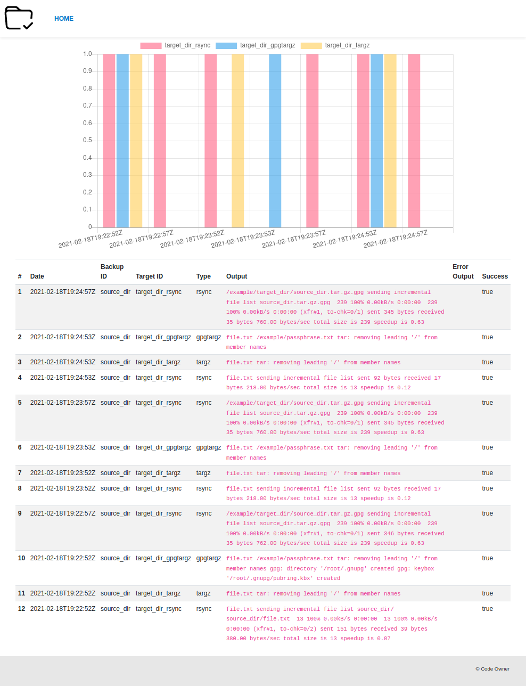

# gobackups

## Table of Contents

- [gobackups](#gobackups)
  - [Table of Contents](#table-of-contents)
  - [Introduction](#introduction)
  - [Technology](#technology)
  - [Example Setup](#example-setup)
    - [Deploying for real](#deploying-for-real)
  - [UI](#ui)
  - [Decrypting an archive](#decrypting-an-archive)
  - [Known Issues](#known-issues)
  - [TODO](#todo)

## Introduction

**Warning: Gobackups is not guaranteed to be stable code! Use at your own risk.** *While I do use this project daily, I wrote it quickly and it is still quite young, so it may not work in all conditions. Verify your setup before relying on it. There is minimal unit test coverage in this repository. If it evolves and becomes popular, that will change.*

Gobackups is a backup utility that allows you to execute consecutive, targeted backups. It solves the following problem scenario:

* I have a directory named `./important_documents`
* I want to automatically `tar.gz` the directory every *N* hours to multiple locations:
  * My flash drive
  * Another computer (over `rsync`)
  * Another directory
* After the previous backups complete, I want to use a GPG passphrase to encrypt the created `tar.gz` file and copy it to multiple locations as well:
  * Another flash drive
  * My portable harddrive
  * Another computer (over `rsync`)

The key behavior that's worth mentioning is that you can programmatically define backups to `await` completion of other backup jobs.

As mentioned above, the following backup methods are supported out of the box:

* `rsync` - the well-known rsync utility, shipped via Alpine Linux in Docker
* `tar.gz` - a simple compressed archive
* `tar.gz.gpg` - essentially a GPG-passphrase-encrypted container

## Technology

This project uses the following components:

* Go 1.15
* Angular 10
* Docker

Additionally, it leverages a few key programs:

* Rsync
* GPG
* Tar
* Gzip

## Example Setup

This setup, viewable under the `./example` directory, requires Docker and Docker compose.

First, identify a directory that contains files you want to backup (`source_dir`).

Then, identify at least one path where you want your backup to be stored (`target_dir`).

In this example, we will back up one directory to three different locations:

* one location using `rsync` to copy the directory exactly as-is
* one location using `tar.gz` to bundle the directory as a compressed archive
* one location using `tar.gz.gpg` to GPG-encrypt the directory as a compressed archive with a passphrase

Afterwards, we will copy the `tar.gz.gpg` to one other location. However, we first need to wait for the file to be produced by the previous job, so we use an `await` condition. The `await` must be added to the parent source as well as each target.

A simple `config.yml` file is all that's needed to accomplish this - see `./example/config.yml` for the result! Note that each backup source/target must have a unique (string) ID.

To run the example, navigate to `./deploy`, and run:

```bash
make build
make run-example
```

Then, in your browser, navigate to `http://localhost:12403`. Periodically refresh to see an updated view of your logs.

To see the results of the backups, look at `./example/source_dir` and `./example/target_dir`. You'll see the created archives/files.

### Deploying for real

From this point forward, in order to curate your own Gobackups setup, you can copy the `./example/config.yml` file into `./deploy/config.yml`, and modify it according to your needs. **Note that the real deployment will not work out of the box unless you spend a few minutes configuring your `config.yml`.** For an immediate working example, please follow the [example](#example-setup) instructions.

By default, the host file system is mounted in the Gobackups container at `/host`, as seen in the file `./deploy/docker-compose.yml`. Therefore, you should define all of your backups to be relative to `/host` in your `./deploy/config.yml` file.

After setting up your `./deploy/config.yml` file, navigate to `./deploy` and run:

```bash
make build # not needed if you already ran it above
make run
```

## UI

This program comes with a simple web interface for viewing backup logs. The Golang portion of this project serves as an API that renders the contents of `./deploy/log.json` (or in the case of the example project, `./example/log-example.json`).

Each log entry contains logs for the backup, including errors if they occur, and whether or not the backup yielded a successful exit code. The graph helps you quickly see if any failures occurred over the last ~100 or so backup jobs, depending on how they are grouped in time.

If a failure occurs, then the value of the chart at the corresponding time will be -1. If it succeeds, it will be +1.



## Decrypting an archive

Use gpg on the command line to decrypt an archive and extract its contents to the current directory:

```bash
gpg -d folder.tar.gz.gpg | tar -xvzf -
```

## Known Issues

* **Important**: If a device (such as a USB flash drive) is not mounted when the container starts (ex. right after rebooting), the Gobackups container will need to be restarted after the mount is properly mounted. When restarting, you will have to perform this action every time until this is fixed.
* In some scenarios, a race condition with writing to the log file, where two or more backup jobs competing to write to the log will get into an infinite cycle of waiting for each other to finish. I have not had time to look into this.

## TODO

* Adding timestamps to backup jobs/archives
* Fix the known issue for disk mounting
* Configurable bind interface / port
* Arbitrary command support
* UI improvements, such as dynamic reloading and alerting of failures
